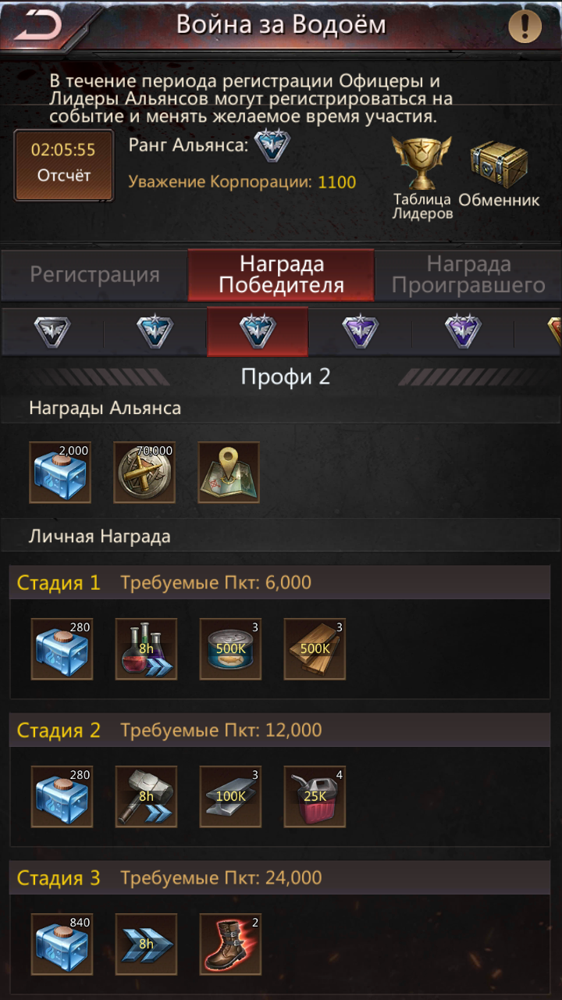

# Война за водоем

## Что это?
В рамках события мы перенеосимся в временную зону

В этой зоне будет помио нас 1 или 2 альянса противника. 
Мы будем бороться за набор очков путем захвата и удержания обьектов.

По окончанию этого события все потерянные юниты будут восстановлены. 
Ресурсы не воруются.
Можно воевать до последнего воина =)

## Цели

Перед альянсом стоит задача достичь 2 цеелй:
- набрать наибольшее число очков в **зачете альянса**
- набрать необходимое количество очков в **личном зачете** для каждого члена альянса

### Личный зачет очков

Для набора очков необходимо разместить свой отряд в любом из строений во временной зоне.

**Размер отряда не имеет значения!**
Поэтому в здания, которые в НАП - заводим по 1 юниту - чтобы все смогли поместится.

В задния не под НАП - заводим свои самы сильные отряды для обороны.

Необходимо в течение всего событися набрать 36к очков (в данный момент мы в слабой лиге - поэтому достаточно 24к)

### Командный зачет очков

Тут учитывается сумма очков всех участников альянса а также дополнительный бонус за проходящие грузовики с водой.

Поэтому стараемся завоевать как можно больше строений, особенно те, через которые идет караван.

## Что делать на воде?

1) Перемещаемся во временную зону
2) Читаем сообщения от командиров о списке зданий в НАП
3) Выбираем место для размещения ШК - так чтобы быть ближе к задниям в НАП
3) Максимально быстро заводим в здания с НАП по 1 юниту - на все свои марши
4) Читаем чат с указания командиров:
    4.1) При необходимости укрепляем захваченные здания
    4.2) При необходимости присоредняемся к групповым атакам на здания
    

## Новый подход к войне

Как многие знают, потери на ЛЗ сильно зависят от состава атакующего отряда: надо посылать сильную защитную стенку перед основной массой войск в отряде. 
Точно такое же правило касается и обороны ШК и объектов на воде.

На этой воде мы попробуем организовать правильные составы обороны обьектов.

### Формирование отряда обороны обьектов
Будем придерживаться следующего принципа:
- **Капитаном отряда** обороны стоит командир с **большей групповой** атакой
- **В каждом здании** будет отряд **танкующих топоров**
- Остальные **укрепления** должны состоять из Лучших отрядов командиров, **без топоров**

### Танкующие топоры
Задача топоров (воинов) - быть передней стенкой, которая принимает урон. Поэтому для них в первую очередь важны показатели здоровья и защиты: как воинов так и отряда.

Для Натули: 

Сильными топорами на данный момент считаем: 
- Фрея
- Ацаси
- Роман (не прилетел)
- Ник (прилетел но мимо)
- Бу

Все остальные посылают на укрепления другие рода войск.

### Работа командиров
Есть три должности, которые могут управлять составами обороны:
- лидер альянса
- военный 
- надсмотрщик

У них есть очень важные возможности:
- смена лидера обороны здания
- исключение отрядов из состава обороны

Также, отправлять отряды назад может командир отряда обороны здания.

Такми образом, необходимо обеспечить правильный состав войск в обороне, а также помогать командирам заходить в здания полным составом.

## Глоссарий
**Танк** (англ. tank) — в компьютерных или настольных ролевых играх — игрок, отвлекающий в бою внимание противника (монстра) на себя, предотвращающий нанесение урона слабозащищённым персонажам (например, магам или лучникам)

**НАП** (NAP) - от английского non-aggression pact, пакт о ненападении - соглашение об отсутвии атак на выбранные обьекты. 
Также можно почитать статью, хоть она к игре и не имеет отношения  https://ru.wikipedia.org/wiki/%D0%9F%D1%80%D0%B8%D0%BD%D1%86%D0%B8%D0%BF_%D0%BD%D0%B5%D0%BD%D0%B0%D0%BF%D0%B0%D0%B4%D0%B5%D0%BD%D0%B8%D1%8F 